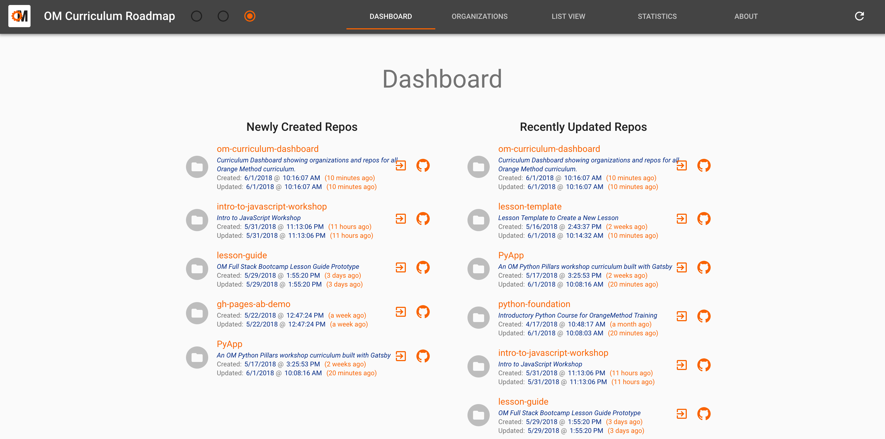

# OM Curriculum Dashboard

You can use this application to keep track of all of GitHub organizations and repositories for OM curriculum and other supporting projects.

The following tabs are provided:

* Dashboard - see the latest changes across all organizations.
* Organizations - see all the organizations and navigate to their details view or their GitHub page.
* List View - see all of the organizations in one big list
* Statistics - see statistics across all organizations and repositories
* About - the about page

The application is deployed [here.](https://om-curriculum-dashboard.apps-np.homedepot.com/).

